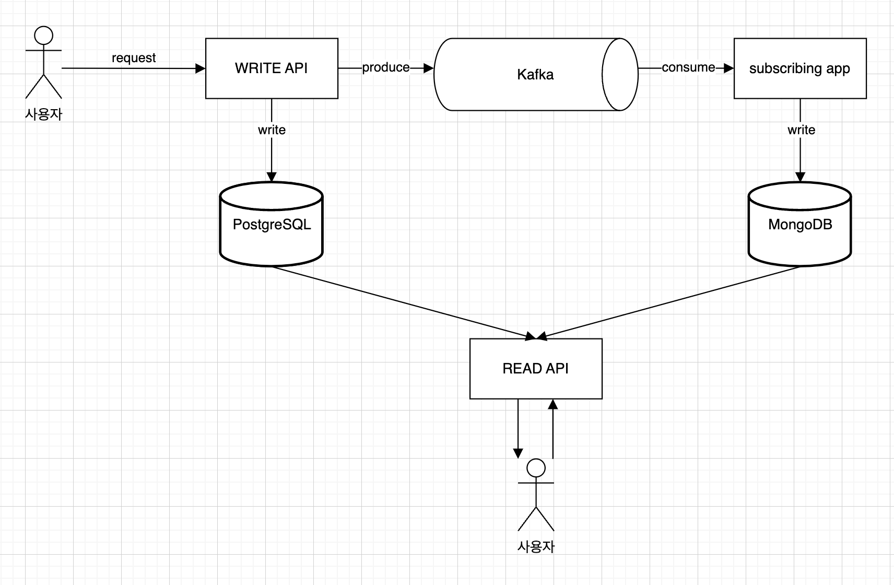

## 프로젝트 목표
사용자가 게시물을 조회하는 시점에, 팔로우하는 사람의 게시물을 조회하는 건 합리적인 생각이다. 이 전략은 팔로우하는 사용자가 몇 명 없을 때는 문제 되지 않는다. \
하지만 팔로우하는 사용자가 늘어난다면, 시간복잡도가 늘어날 수밖에 없는 한계점을 갖고 있다.
```
log(Follow 전체 레코드) + 해당회원의 Following * log(Post 전체 레코드)
```
위에서 살펴봤듯이 팔로우하는 사람이 늘어나면 늘어날수록 SQL 조건이 or 로 덕지덕지 늘어나는 구조이다.
이를 개선하보고자 X, instagram 에서 사용하는 Fan-out-on-write 전략을 사용하여 사용자를 팔로우하는 팔로워들에게 데이터를 Timeline 테이블에 넣어주는 개념을 적용해보겠다.
Timeline 테이블을 만들고 사용자가 게시물을 조회하는 시점에 시간복잡도에서 이득을 가져 가는 것이다.



## 프로젝트에 사용된 S/W
- Docker
- PostgreSQL
- MongoDB
- Kafka, Zookeeper
- Kafka-ui

위 S/W 는 도커 컨테이너로 기동하여 프로젝트를 진행했다. `compose.yaml` 을 참고하자.
```bash
# 도커 컨테이너 기동
docker compose up -d
```

>참고로 postgresql 은 docker-entrypoint 에 필요한 셋팅을 해두었으나, MongoDB 는 아래 가이드를 참고. 
## MongoDB 초기 셋팅 관련
```bash
# intellij 로 접속할 경우 아래와 같이 함.
# mongodb://localhost:27017/papascar?authSource=admin

# 이외 도커 컨테이너로 직접 진입하여 아래 초기화 작업 진행. docker entry script 는.. 추후에 알아보겠음
docker exec -it mongodb mongosh -u admin -p 1234 --authenticationDatabase admin

use papascar;

db.createCollection("timelines")

db.timelines.createIndex({ "followerUserId": -1, "createdAt": -1 })

db.timelines.createIndex({ "carId": -1 } )

db.timelines.getIndexes()
```


