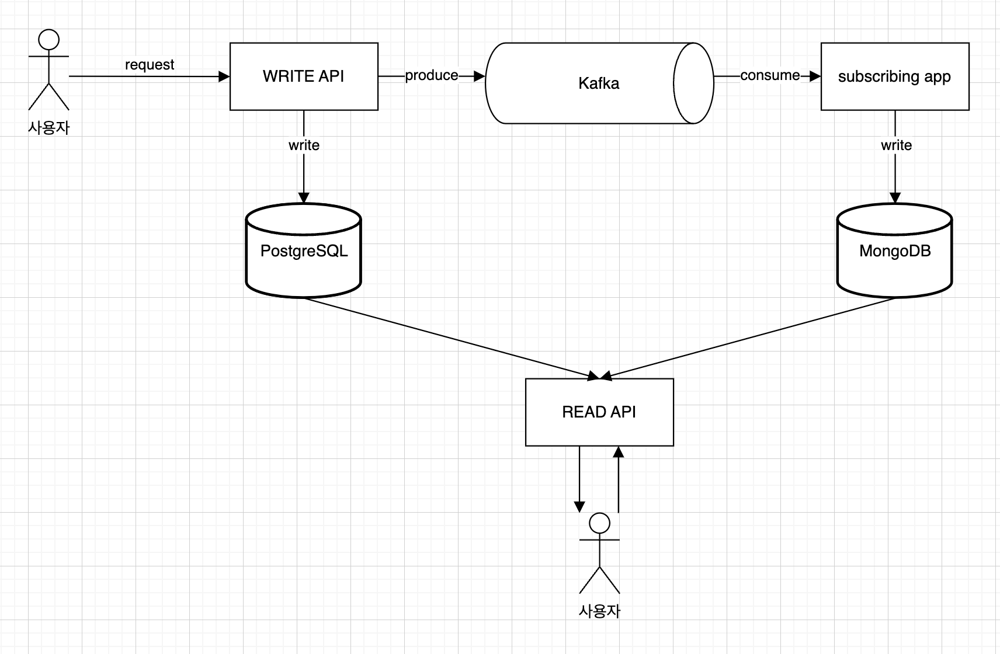
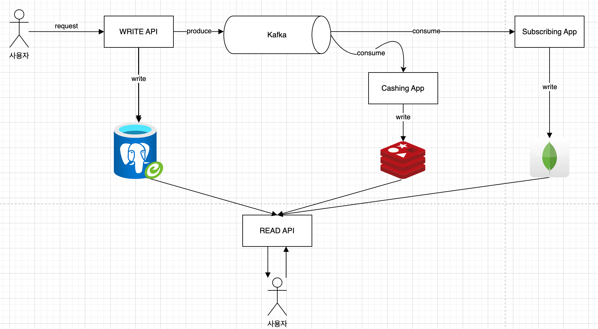

## 프로젝트 목표1. Fan out on write(Feat. 구독서비스)
사용자가 게시물을 조회하는 시점에, 팔로우하는 사람의 게시물을 조회하는 건 합리적인 생각이다. 이 전략은 팔로우하는 사용자가 몇 명 없을 때는 문제 되지 않는다. \
하지만 팔로우하는 사용자가 늘어난다면, 시간복잡도가 늘어날 수밖에 없는 한계점을 갖고 있다. 왜 그런지 아래의 시간복잡도를 살펴보자.
```
log(Follow 전체 레코드) + 해당회원의 Following * log(Post 전체 레코드)
```
위에서 살펴봤듯이 팔로우하는 사람이 증가할수록 탐색 시간이 길어지는 구조를 갖는다.
즉 팔로우하는 사람이 늘어나면 늘어날수록 SQL 조건이 or 가 늘어나는 구조이다.
이걸 어떻게 해결하면 좋을지 고민해보고 베스트 프렉티스는 무엇인지 자료조사를 해보니, X, instagram 은 Fan-out-on-write 전략을 사용한다.
Fan-out-on-write 전략은 특정 사용자가 게시물을 작성하는 시점에 팔로워들에게 해당 컨텐츠를 Timeline 테이블에 넣어주는 개념이다.
그랬을 때 팔로잉하는 사용자는 게시물을 조회할 때 일일이 팔로우하는 사용자들의 아이디를 조건절에 넣을 필요 없이 자신의 Timeline 을 기반으로 조회하게 되고, 이는 마치 인덱스를 활용하게 해주는 것과 유사한 효과를 보여준다.
즉, 기존의 조회 시점에서 발생했던 부하를 쓰기 시점의 부하로 바꿔버린 셈이다.



## 프로젝트에 사용된 S/W
- Docker
- PostgreSQL
- MongoDB
- Kafka, Zookeeper
- Kafka-ui
- Redis

위 S/W 는 도커 컨테이너로 기동하여 프로젝트를 진행했다. `compose.yaml` 을 참고하자.
```bash
# 도커 컨테이너 기동
docker compose up -d
```

>참고로 postgresql 은 docker-entrypoint 에 필요한 셋팅을 해두었으나, MongoDB 는 아래 가이드를 참고. 
## MongoDB 초기 셋팅 관련
```bash
# intellij 로 접속할 경우 아래와 같이 함.
# mongodb://localhost:27017/papascar?authSource=admin

# 이외 도커 컨테이너로 직접 진입하여 아래 초기화 작업 진행. docker entry script 는.. 추후에 알아보겠음
docker exec -it mongodb mongosh -u admin -p 1234 --authenticationDatabase admin

use papascar;

db.createCollection("timelines")

db.timelines.createIndex({ "followerUserId": -1, "createdAt": -1 })

db.timelines.createIndex({ "carId": -1 } )

db.timelines.getIndexes()
```

## 프로젝트 목표2. Cache Layer 구축
Redis를 도입하여 캐시 레이어를 체계적으로 구축함으로써, 빈번한 데이터 요청이 바로 RDB로 향하지 않도록 트래픽 흐름을 제어하고, 시스템 전체의 부하를 효과적으로 분산시켜 안정성과 응답 속도를 동시에 향상시키는 구조를 마련해보자!


대표적인 캐시전략은 다음과 같다.
- Cache Aside
    - 설명
        - 앱이 캐시를 옆에 두고 필요할 때만 데이터를 캐시에 로드하는 전략임.
        - 즉, 앱이 먼저 캐시에 데이터를 요청하고, 없으면 데이터베이스에서 읽어와서 캐시에 저장한 후 반환하는 방식이다.
        - 데이터 쓰기/갱신 시, DB에 먼저 반영한 후 캐시를 무효화(또는 삭제)한다.
    - 동작 흐름
        - READ
            - 캐시에 요청 ->없으면 DB 조회 -> 캐시에 저장 -> 응답
        - WRITE
            - DB 에 저장 -> 캐시 삭제 or 무효화
    - 장점
        - 자주 조회되는 데이터만 캐시에 존재 -> 메모리 효율적
        - DB 가 항상 최신 상태 유지됨.
    - 단점
        - 최초 조회 시 느림
        - 쓰기 후 읽기 사이에 캐시가 갱신되지 않으면 stale data 발생 가능

- Read Through Cache
    - 설명
        - 캐시가 읽기 로직을 담당한다. 애플리케이션은 캐시에만 요청을 보내며, 캐시가 알아서 DB 에서 데이터를 가져오고 저장한다.
    - 동작 흐름
        - READ
            - 캐시에 요청 -> 캐시에 없으면 -> DB 조회 -> 캐시에 저장 -> 응답
            - (참고로 cache aside 전략과 똑같아 보이지만, 캐싱 주체가 다르다는 차이점이 있음, cache asdie 는 개발자가 주체적으로 하지만, read through 에서는 개발자가 아닌 라이브러리나 타 미들웨어에 위임함)
        - WRITE
            - 전략에 따라 다름(보통은 Write Through 또는 Write Around 와 함께 사용)
    - 장점
        - 일관된 캐시에 액세스 방식(앱은 캐시만 사용)
        - 로직 단순화
    - 단점
        - 캐시가 DB 접근 책임도 져야 하므로 구현이 복잡해질 수 있음.

- Write Through Cache
    - 설명
        - 쓰기 요청이 캐시와 DB 에 동시에 반영된다. 쓰기 시점에 캐시와 저장소가 항상 동기화된다.
    - 동작 흐름
        - WRITE
            - 캐시에 쓰기
            - 동시에 DB 에 쓰기
    - 장점
        - 캐시와 DB 의 일관성 유지
        - 쓰기 후 즉시 읽으면 최신 데이터 존재
    - 단점
        - 모든 쓰기에 대해 DB 작업이 발생하므로 느릴 수 있음
        - 불필요한 캐시 쓰기 오버헤드 가능

- Write Around Cache
    - 설명
        - 쓰기 시 캐시는 무시하고 DB 에만 반영한다. 캐시는 읽기 요청을 통해서만 갱신된다.
    - 동작 흐름
        - WRITE
            - DB 에만 저장
        - READ
            - 캐시에 없으면 DB 조회 후 캐시에 저장
    - 장점
        - 불필요하면 캐시 갱신 방지(쓰기 잦은 데이터가 캐시게 안 들어옴)
        - 캐시 오염 줄임
    - 단점
        - 쓰기 직후 읽기 시 캐시 미스 -> 느릴 수 있음.

- Write Back Cache(Write Behind)
    - 설명
        - 쓰기 요청은 먼저 캐시에만 반영하고, 비동기적으로 나중에 DB 에 저장된다.
    - 동작 흐름
        - WRITE
            - 캐시에 쓰기
            - 백그라운드로 DB 에 반영
    - 장점
        - 쓰기 속도에 매우 빠름
        - 쓰기 요청이 집중되는 시스템에 유리
    - 단점
        - 캐시 손실 시 데이터 유실 위험 있음.
        - 복잡한 장애 대응 필요
        - DB 와 캐시 간 일관성 문제가 발생할 수 있음.

위 전략 중에 읽기는 Cache Aside 혹은 Read Through, 쓰기는 Write Through 방식이 좋을 것 같음.

Redis 는 도커 컨테이너로 기동 시키므로, `compose.yaml` 을 참고! 

redis port 는 다음과 같음.
```java
public interface ResolvedCarCachePort {
    // 참고로 구현체에서 RedisTemplate 이 제공하는, set, get, multiGet, delete 를 사용하면 될듯함
    void set(ResolvedCar resolvedCar); // 단건 컨텐츠 캐싱
    ResolvedCar get(Long carId); // 캐싱된 단건 컨텐츠 조회
    List<ResolvedCar> multiGet(List<Long> carIds); // 캐싱된 컨텐츠 리스트 조회 
    void delete(Long carId); // 캐싱된 컨텐츠 삭제,
}
```